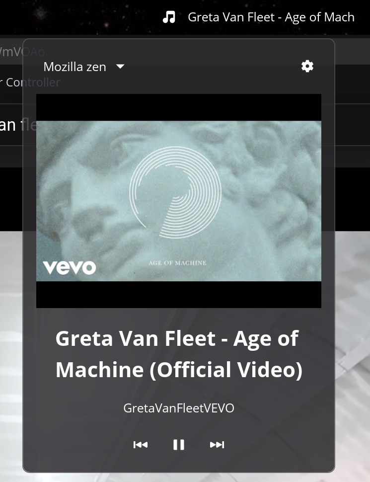

<p align="center">
  
</p>

<h1 align="center">COSMIC Media Now Playing Applet</h1>

<p align="center">
  <strong>A panel applet for the <a href="https://github.com/pop-os/cosmic-epoch">COSMIC™ Desktop Environment</a> that displays the currently playing media track.</strong>
</p>

<p align="center">
  
</p>

<p align="center">
  <a href="#features">Features</a> •
  <a href="#installation">Installation</a> •
  <a href="#usage">Usage</a> •
  <a href="#configuration">Configuration</a> •
  <a href="#architecture">Architecture</a> •
  <a href="#contributing">Contributing</a> •
  <a href="#license">License</a>
</p>

---

## Overview

**cosmic-media-now-playing-applet** is a lightweight panel applet that integrates with any [MPRIS](https://specifications.freedesktop.org/mpris-spec/latest/)-compatible media player (Spotify, Firefox, Chromium, VLC, Rhythmbox, Amberol, etc.) and displays the currently playing track directly on your COSMIC panel bar.

The applet shows album art, playback controls, and the track title in a popup. When the track name is too long to fit in the panel widget, it scrolls smoothly in a marquee-style animation. All settings are configurable through the popup and persist across restarts.

When no media is playing, the applet takes up no panel space at all.

---

## Features

| Feature | Description |
|---------|-------------|
| **🎵 Inline Panel Display** | Shows a music icon and track name directly on the COSMIC panel bar |
| **🖼️ Album Art** | Displays rounded album art in the popup, fetched from any source |
| **⏯️ Playback Controls** | Play/pause, previous, and next buttons in the popup |
| **🎛️ Player Selector** | Dropdown to choose which player to control when multiple are active |
| **🔄 Auto-Switching** | Automatically follows whichever player starts playing |
| **📜 Marquee Scrolling** | Long track titles scroll smoothly with adjustable speed |
| **📏 Configurable Width** | Adjust the widget width from 100px to 500px via a slider |
| **🎨 Display Formats** | Choose between Title Only, Artist — Title, or Title — Artist |
| **👻 Invisible When Idle** | Takes up zero panel space when nothing is playing |
| **💾 Persistent Settings** | Configuration survives restarts via COSMIC's `cosmic-config` system |
| **🔌 Universal Compatibility** | Works with **any** MPRIS-compatible media player |
| **📦 Sandbox-Aware** | Album art works across Flatpak, Snap, and native packages |
| **🦀 Pure Rust** | No C library dependencies — uses `zbus` for native D-Bus communication |
| **🌐 Internationalization** | Built-in i18n support with Fluent localization |

### Supported Media Players

Any application that implements the [MPRIS D-Bus Interface](https://specifications.freedesktop.org/mpris-spec/latest/) will work, including but not limited to:

- **Spotify** (desktop app)
- **Firefox** / **Chromium** / **Chrome** / **Epiphany** (web media)
- **VLC Media Player**
- **Amberol**
- **Rhythmbox**
- **Lollypop**
- **GNOME Music**
- **Celluloid (MPV)**
- **Audacious**
- **Clementine / Strawberry**
- **Elisa**
- **Any other MPRIS-compatible player**

### Album Art Sources

The applet fetches album art from whatever source the player provides:

- **`file://` URLs** — read directly, or via `/proc/<pid>/root` to reach files inside Flatpak and Snap sandboxes
- **`data:` URIs** — base64-encoded inline images (used by Firefox)
- **`https://` URLs** — fetched over HTTP (used by Spotify, etc.)
- **YouTube thumbnails** — automatically derived from the track URL when the player is a browser playing a YouTube video and the art file is otherwise inaccessible

---

## Installation

### Prerequisites

You need a working Rust toolchain (installed via [rustup](https://rustup.rs)) and a few system development libraries.

> **Note:** Use rustup rather than the system Rust package. rust-analyzer and other tooling work significantly better with the rustup-managed toolchain.

```bash
curl --proto '=https' --tlsv1.2 -sSf https://sh.rustup.rs | sh
```

#### Ubuntu / Pop!_OS / Debian

```bash
sudo apt install -y \
    cmake \
    pkg-config \
    libexpat1-dev \
    libfontconfig-dev \
    libfreetype-dev \
    libxkbcommon-dev \
    libinput-dev \
    libgbm-dev \
    libseat-dev \
    libudev-dev
```

#### Fedora

```bash
sudo dnf install -y \
    cmake \
    pkg-config \
    expat-devel \
    fontconfig-devel \
    freetype-devel \
    libxkbcommon-devel \
    libinput-devel \
    mesa-libgbm-devel \
    libseat-devel \
    systemd-devel
```

#### Arch Linux

```bash
sudo pacman -S --needed \
    cmake \
    pkg-config \
    expat \
    fontconfig \
    freetype2 \
    libxkbcommon \
    libinput \
    seatd
```

### Build & Install

#### Using the install script (recommended)

```bash
git clone https://github.com/stldave314/cosmic-media-now-playing-applet.git
cd cosmic-media-now-playing-applet

# Build and install in one step
./install.sh build-install
```

The install script automatically reloads the COSMIC panel after installing so changes take effect immediately.

#### Using cargo directly

```bash
git clone https://github.com/stldave314/cosmic-media-now-playing-applet.git
cd cosmic-media-now-playing-applet

cargo build --release

sudo install -Dm0755 target/release/cosmic-media-now-playing-applet /usr/bin/cosmic-media-now-playing-applet
sudo install -Dm0644 resources/app.desktop /usr/share/applications/com.github.cosmic_media_now_playing_applet.desktop
sudo install -Dm0644 resources/app.metainfo.xml /usr/share/appdata/com.github.cosmic_media_now_playing_applet.metainfo.xml
sudo install -Dm0644 resources/icon.svg /usr/share/icons/hicolor/scalable/apps/com.github.cosmic_media_now_playing_applet.svg
```

### Install Script Commands

| Command | Description |
|---------|-------------|
| `./install.sh build` | Build the applet in release mode |
| `./install.sh install` | Install to system (requires sudo) and reload the panel |
| `./install.sh build-install` | Build and install in one step |
| `./install.sh uninstall` | Remove from system (with optional config cleanup) |
| `./install.sh reinstall` | Full uninstall → rebuild → reinstall cycle |
| `./install.sh status` | Check what's currently installed |
| `./install.sh clean` | Remove build artifacts |
| `./install.sh help` | Show all available commands |

You can also set a custom install prefix:

```bash
PREFIX=/usr/local ./install.sh build-install
```

### Uninstalling

```bash
./install.sh uninstall
```

---

## Usage

### Adding to the panel

After installing:

1. Open **COSMIC Settings** → **Desktop** → **Panel**
2. Click **Add Applet** in the panel configuration
3. Find **"Now Playing"** in the applet list
4. Add it to your desired panel position

### Testing without installing

```bash
cargo run --release
```

> **Note:** The applet is designed to run within the COSMIC panel. Running it standalone will open a test window, but popup positioning and panel sizing will behave differently than in production.

### What you'll see

When media is playing, the applet shows on the panel:

```
♫ Artist Name — Track Title
```

- **Nothing playing:** the applet is completely invisible and takes up no space
- **Text too long:** it scrolls smoothly like a marquee
- **Click the applet:** opens a popup with album art, track info, playback controls, and settings

---

## Configuration

### Media Popup

Click the applet on the panel to open the media popup. It shows:

- **Player selector** — dropdown to choose which player to control when more than one is active
- **Album art** — rounded art fetched from the player, falls back to a music note icon
- **Track title and artist**
- **Playback controls** — previous, play/pause, next

Click the gear icon (⚙) to switch to the settings view.

### Settings

All settings take effect immediately and are saved automatically.

#### Widget Width

Controls how much horizontal space the applet occupies on the panel.

- **Range:** 100px — 500px
- **Default:** 200px
- Changes are debounced — the panel resizes cleanly after you stop dragging

#### Top Margin

Shifts the panel text vertically to align with other applets if needed.

- **Range:** -10px — 20px
- **Default:** 0px

#### Scroll Speed

Controls how fast long text scrolls. Drag the slider left for slower, right for faster.

- **Range:** 1 (slowest, ~300ms/step) — 10 (fastest, ~30ms/step)
- **Default:** 5
- Lower speeds are easier to read for longer titles

#### Display Format

Dropdown to select how track metadata is formatted:

| Format | Example Output |
|--------|---------------|
| **Title Only** | `Bohemian Rhapsody` |
| **Artist — Title** | `Queen — Bohemian Rhapsody` (default) |
| **Title — Artist** | `Bohemian Rhapsody — Queen` |

> If the player provides no artist, all formats display the title alone.

### Config File Location

Settings are stored via COSMIC's `cosmic-config` system at:

```
~/.config/cosmic/com.github.cosmic_media_now_playing_applet/v1/
```

---

## Architecture

### Technology Stack

| Component | Technology |
|-----------|-----------|
| **GUI Framework** | [libcosmic](https://github.com/pop-os/libcosmic) (iced-based) |
| **D-Bus Communication** | [zbus](https://crates.io/crates/zbus) v5 (pure Rust, async) |
| **Async Runtime** | [Tokio](https://tokio.rs/) |
| **Config Persistence** | [cosmic-config](https://github.com/pop-os/libcosmic) |
| **Localization** | [i18n-embed](https://crates.io/crates/i18n-embed) + [Fluent](https://projectfluent.org/) |
| **HTTP (album art)** | [reqwest](https://crates.io/crates/reqwest) |

### How It Works

```
┌─────────────────────────────────────────────────────┐
│                    COSMIC Panel                      │
│                                                      │
│   ┌──────────────────────────────────────────────┐  │
│   │  ♫  Artist — Track Title  ←←← scrolling      │  │
│   └──────────────┬───────────────────────────────┘  │
│                  │ click                             │
│   ┌──────────────▼───────────────────────────────┐  │
│   │  [Player Dropdown ▾]                    [⚙]  │  │
│   │  ┌──────────────────────────────────────┐    │  │
│   │  │         🖼 Album Art (rounded)        │    │  │
│   │  └──────────────────────────────────────┘    │  │
│   │           Track Title                         │  │
│   │           Artist Name                         │  │
│   │        [⏮]  [⏯]  [⏭]                        │  │
│   └──────────────────────────────────────────────┘  │
└─────────────────────────────────────────────────────┘

     Background Subscriptions:
     ┌──────────────────────┐
     │  MPRIS Poller (1s)   │──→ D-Bus session bus
     │  Scroll Timer        │──→ marquee animation
     │  Config Watcher      │──→ cosmic-config
     └──────────────────────┘
```

### Source Structure

```
cosmic-media-now-playing-applet/
├── Cargo.toml                # Dependencies & project metadata
├── install.sh                # Build/install/uninstall script
├── i18n.toml                 # Localization configuration
├── i18n/
│   └── en/
│       └── cosmic_media_now_playing_applet.ftl   # English strings
├── resources/
│   ├── app.desktop           # Desktop entry for COSMIC panel
│   ├── app.metainfo.xml      # AppStream metadata
│   ├── icon.svg              # Applet icon
│   └── screenshot.png        # README screenshot
└── src/
    ├── main.rs               # Entry point — i18n init + applet launch
    ├── app.rs                # Application model, view, update, subscriptions
    ├── config.rs             # Persistent configuration types
    ├── mpris.rs              # Pure-Rust MPRIS D-Bus client (zbus)
    └── i18n.rs               # Localization boilerplate
```

### Key Design Decisions

**Pure-Rust D-Bus:** Uses [zbus](https://crates.io/crates/zbus) — a pure-Rust, async D-Bus implementation — instead of wrapping C libraries. This eliminates all C D-Bus dependencies.

**Sandbox-aware art loading:** Album art `file://` paths reported by MPRIS often point inside a sandboxed process's private filesystem. The applet resolves these by looking up the player's PID via D-Bus and reading through `/proc/<pid>/root/<path>`, which works uniformly for Flatpak, Snap, and any other Linux sandboxing technology. YouTube thumbnails are used as a fallback for browsers when the art file is otherwise unreachable.

**Auto-switching:** The applet detects when a player transitions from paused to playing and automatically switches focus to it, making it natural to switch between multiple open players.

**Debounced panel resizing:** Width slider changes are committed to the panel only after 1.5 seconds of inactivity, sending a single clean resize request rather than many rapid ones that could cause applets to overlap.

**Marquee Scrolling:** Implemented via character-offset windowing on a looping buffer. The scroll subscription is completely disabled when the text fits within the widget, saving CPU cycles.

---

## Troubleshooting

### Applet is not visible even though music is playing

The applet hides itself when no track title is available. Some players take a moment to populate MPRIS metadata after starting. If it never appears:

1. **Check MPRIS support:**
   ```bash
   busctl --user list | grep MediaPlayer2
   ```
   You should see entries like `org.mpris.MediaPlayer2.spotify`.

2. **Web browsers:** Firefox and Chromium expose MPRIS when playing audio/video. Make sure the tab with media is active.

### Album art not showing

- For **local music players**, art is usually embedded — should work automatically.
- For **browsers playing YouTube**, the applet extracts the video ID from the track URL and fetches the thumbnail directly from YouTube's CDN.
- For **Spotify**, art is fetched via HTTPS from Spotify's CDN.
- If art still doesn't appear, check that the applet has network access and that the player is exposing `mpris:artUrl`.

### Applet doesn't appear in the COSMIC Settings applet list

Make sure all files are installed:
```bash
./install.sh status
```

If anything is missing:
```bash
./install.sh reinstall
```

### Applet overlaps other panel items after resizing

Drag the width slider and wait ~2 seconds after releasing — the panel redraws automatically once the resize request settles.

### Build errors about missing system libraries

Install all development dependencies listed in the [Prerequisites](#prerequisites) section for your distro.

---

## Contributing

Contributions are welcome! Here are some ways you can help:

- 🐛 **Report bugs** — Open an issue with steps to reproduce
- 💡 **Suggest features** — Open an issue with your idea
- 🔧 **Submit PRs** — Fork, branch, code, and open a pull request
- 🌐 **Add translations** — Create a new file in `i18n/<lang_code>/cosmic_media_now_playing_applet.ftl`

### Adding a Translation

1. Copy `i18n/en/cosmic_media_now_playing_applet.ftl` to `i18n/<your_lang>/`
2. Translate the strings
3. Submit a PR

Example for Spanish (`i18n/es/cosmic_media_now_playing_applet.ftl`):

```ftl
no-media = Sin reproducción
widget-width = Ancho del widget
scroll-speed = Velocidad de desplazamiento
display-format = Formato de visualización
format-title-only = Solo título
format-artist-title = Artista — Título
format-title-artist = Título — Artista
app-title = Reproduciendo ahora
top-margin = Margen superior
```

---

## License

This project is licensed under the **GNU General Public License v3.0** — see the [LICENSE](LICENSE) file for details.

---

## Acknowledgments

- [COSMIC Desktop Environment](https://github.com/pop-os/cosmic-epoch) by System76
- [libcosmic](https://github.com/pop-os/libcosmic) — the COSMIC application framework
- [zbus](https://crates.io/crates/zbus) — pure-Rust D-Bus implementation
- [MPRIS Specification](https://specifications.freedesktop.org/mpris-spec/latest/) — the media player interface standard

---

<p align="center">
  Made with 🦀 for the COSMIC Desktop
</p>
