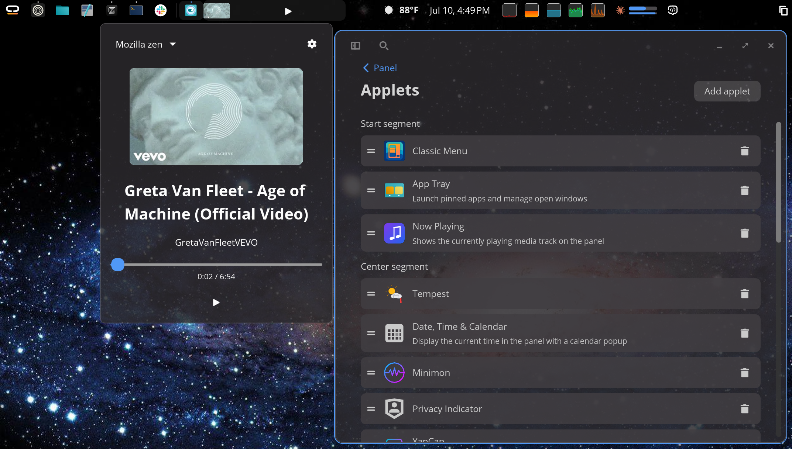
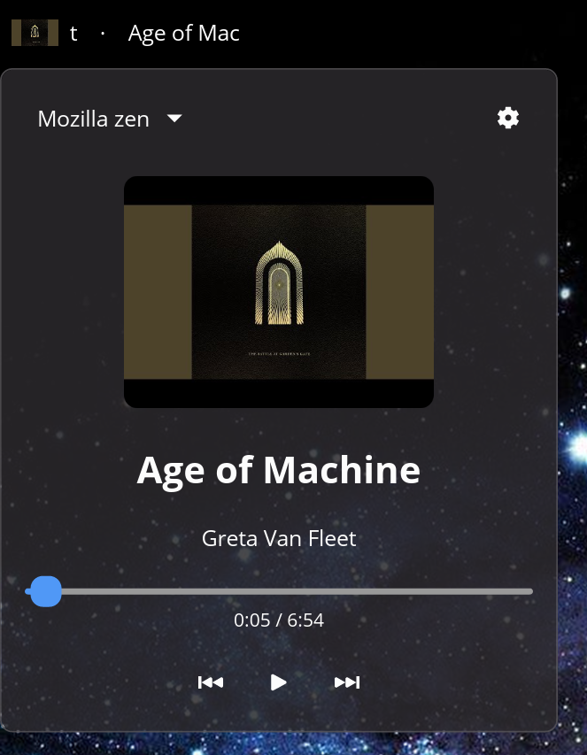
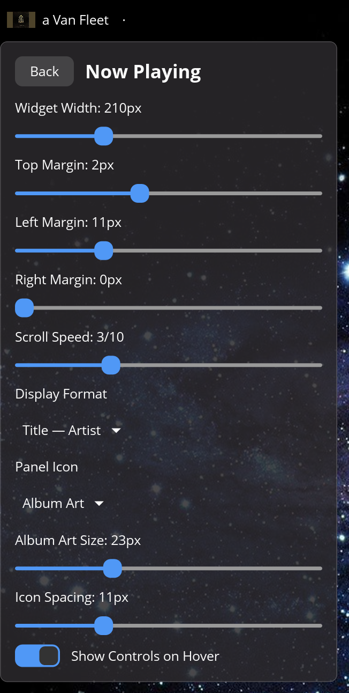

<p align="center">
  
</p>

<h1 align="center">COSMIC Media Now Playing Applet</h1>

<p align="center">
  <strong>A panel applet for the <a href="https://github.com/pop-os/cosmic-epoch">COSMIC™ Desktop Environment</a> that displays the currently playing media track.</strong>
</p>

<p align="center">
  
</p>

---

## Table of Contents

- [Overview](#overview)
- [Screenshots](#screenshots)
- [Features](#features)
  - [Supported Media Players](#supported-media-players)
  - [Album Art Sources](#album-art-sources)
- [Installation](#installation)
  - [Prerequisites](#prerequisites)
  - [Build & Install](#build--install)
  - [Install Script Commands](#install-script-commands)
- [Usage](#usage)
- [Configuration](#configuration)
  - [Settings Reference](#settings-reference)
  - [Config File Location](#config-file-location)
- [Architecture](#architecture)
  - [Technology Stack](#technology-stack)
  - [Source Structure](#source-structure)
  - [Key Design Decisions](#key-design-decisions)
- [Troubleshooting](#troubleshooting)
- [Contributing](#contributing)
- [License](#license)

---

## Overview

**cosmic-media-now-playing-applet** is a lightweight panel applet that integrates with any [MPRIS](https://specifications.freedesktop.org/mpris-spec/latest/)-compatible media player (Spotify, Firefox, Chromium, VLC, Rhythmbox, Amberol, …) and shows the currently playing track directly on your COSMIC panel bar.

On the panel it displays the album art (or a music-note icon) next to the track title, and reveals inline playback controls on hover. Clicking anywhere on the widget opens a popup with larger album art, a seekable progress bar, playback controls, a player selector, and settings. Long titles scroll in a marquee (which you can slow, speed up, or turn off). When nothing is playing, the applet takes up **zero** panel space.

It's **pure Rust** — no C D-Bus bindings — and every setting persists across restarts via COSMIC's `cosmic-config`.

---

## Screenshots

| Panel widget + media popup | Settings | Inline hover controls |
|:--:|:--:|:--:|
|  |  |  |

---

## Features

| Feature | Description |
|---------|-------------|
| 🎵 **Inline panel display** | Album art (or music-note icon) plus the track name, right on the panel bar |
| 🖼️ **Panel album art** | The panel icon can be the live album-art thumbnail, a music note, or nothing |
| 🎚️ **Hover controls** | Hover the panel for inline previous / play-pause / next; the icon/art still opens the popup |
| 🧭 **Capability-aware buttons** | Previous/next are hidden automatically when the player doesn't support them (MPRIS `CanGoNext`/`CanGoPrevious`) |
| ⏩ **Seekable progress bar** | Scrub the track with a draggable slider and elapsed / total time in the popup |
| 🔗 **Click art to open source** | Clicking the popup album art opens the track's URL (e.g. the YouTube tab) in your browser |
| 🎛️ **Player selector** | Choose which player to control when several are active |
| 🔄 **Auto-switching** | Automatically follows whichever player starts playing |
| 📜 **Marquee scrolling** | Long titles scroll with adjustable speed — or set it to **Off** for a static title |
| 📏 **Width, margins & spacing** | Widget width (100–500 px), top/left/right margins, and the icon-to-title gap |
| 🎨 **Display formats** | Title Only, Artist — Title, or Title — Artist |
| 🖱️ **Click anywhere** | The whole widget is clickable (with a pointer cursor) to open the popup |
| 👻 **Invisible when idle** | Takes up zero panel space when nothing is playing |
| 📦 **Sandbox-aware art** | Works across Flatpak, Snap, and native packages |
| 🦀 **Pure Rust + i18n** | `zbus` for native D-Bus; Fluent-based localization |

### Supported Media Players

Anything implementing the [MPRIS D-Bus interface](https://specifications.freedesktop.org/mpris-spec/latest/) works — Spotify, Firefox/Chromium/Chrome/Epiphany (web media), VLC, Amberol, Rhythmbox, Lollypop, GNOME Music, Celluloid (MPV), Audacious, Clementine/Strawberry, Elisa, and more.

### Album Art Sources

The applet loads art from whatever the player exposes:

- **`file://` URLs** — read directly, or via `/proc/<pid>/root` to reach files inside Flatpak/Snap sandboxes
- **`data:` URIs** — base64-encoded inline images (used by Firefox)
- **`https://` URLs** — fetched over HTTP (Spotify, etc.)
- **YouTube thumbnails** — derived from the track URL when a browser plays a YouTube video and the art file is otherwise inaccessible

---

## Installation

### Prerequisites

A working Rust toolchain (via [rustup](https://rustup.rs)) plus a few system development libraries.

> **Note:** Prefer rustup over the distro Rust package — rust-analyzer and other tooling work far better with the rustup-managed toolchain.

```bash
curl --proto '=https' --tlsv1.2 -sSf https://sh.rustup.rs | sh
```

<details>
<summary><strong>Ubuntu / Pop!_OS / Debian</strong></summary>

```bash
sudo apt install -y \
    cmake pkg-config libexpat1-dev libfontconfig-dev libfreetype-dev \
    libxkbcommon-dev libinput-dev libgbm-dev libseat-dev libudev-dev
```
</details>

<details>
<summary><strong>Fedora</strong></summary>

```bash
sudo dnf install -y \
    cmake pkg-config expat-devel fontconfig-devel freetype-devel \
    libxkbcommon-devel libinput-devel mesa-libgbm-devel libseat-devel systemd-devel
```
</details>

<details>
<summary><strong>Arch Linux</strong></summary>

```bash
sudo pacman -S --needed \
    cmake pkg-config expat fontconfig freetype2 libxkbcommon libinput seatd
```
</details>

### Build & Install

**Using the install script (recommended)** — builds, installs, and reloads the COSMIC panel so changes take effect immediately:

```bash
git clone https://github.com/stldave314/cosmic-media-now-playing-applet.git
cd cosmic-media-now-playing-applet
./install.sh build-install
```

<details>
<summary><strong>Using cargo directly</strong></summary>

```bash
cargo build --release

sudo install -Dm0755 target/release/cosmic-media-now-playing-applet /usr/bin/cosmic-media-now-playing-applet
sudo install -Dm0644 resources/app.desktop /usr/share/applications/com.github.cosmic_media_now_playing_applet.desktop
sudo install -Dm0644 resources/app.metainfo.xml /usr/share/appdata/com.github.cosmic_media_now_playing_applet.metainfo.xml
sudo install -Dm0644 resources/icon.svg /usr/share/icons/hicolor/scalable/apps/com.github.cosmic_media_now_playing_applet.svg
```
</details>

A custom prefix is supported: `PREFIX=/usr/local ./install.sh build-install`.

### Install Script Commands

| Command | Description |
|---------|-------------|
| `./install.sh build` | Build in release mode |
| `./install.sh install` | Install to system (sudo) and reload the panel |
| `./install.sh build-install` | Build and install in one step |
| `./install.sh uninstall` | Remove from system (with optional config cleanup) |
| `./install.sh reinstall` | Full uninstall → rebuild → reinstall |
| `./install.sh status` | Show what's currently installed |
| `./install.sh clean` | Remove build artifacts |
| `./install.sh help` | List all commands |

---

## Usage

**Add it to the panel:** COSMIC Settings → **Desktop** → **Panel** → **Add Applet** → **"Now Playing"**, then place it where you like.

**Try it without installing:** `cargo run --release`. (It's designed for the COSMIC panel; standalone it opens a test window, and popup positioning/panel sizing behave differently than in production.)

When media is playing you'll see the album art/icon and the (scrolling) title on the panel. **Hover** for inline controls; **click anywhere** to open the popup. When nothing is playing, the applet is invisible.

---

## Configuration

Click the applet to open the **media popup** (player selector, album art, title/artist, seek bar, and playback controls), then click the gear icon (⚙) for **settings**. All settings apply immediately and save automatically.

### Settings Reference

| Setting | Range / Options | Default | Notes |
|---------|-----------------|---------|-------|
| **Widget Width** | 100 – 500 px | 200 px | Debounced — the panel resizes cleanly after you stop dragging |
| **Top Margin** | -10 – 20 px | 0 px | Shifts content vertically |
| **Left Margin** | 0 – 40 px | 0 px | Padding before the icon/content |
| **Right Margin** | 0 – 40 px | 0 px | Padding after the content |
| **Scroll Speed** | Off, 1 – 10 | 5 | 1 ≈ 300 ms/step, 10 ≈ 30 ms/step. **Off** keeps the visible portion static until the track changes |
| **Display Format** | Title Only · Artist — Title · Title — Artist | Artist — Title | Falls back to title alone when the player reports no artist |
| **Panel Icon** | Album Art · Music Note · No Icon | Album Art | Album Art falls back to a music note when no art is available |
| **Album Art Size** | 12 – 48 px | 16 px | Size of the panel thumbnail (and music-note fallback) |
| **Icon Spacing** | 0 – 40 px | 6 px | Gap between icon/art and title; hidden when Panel Icon is "No Icon" |
| **Show Controls on Hover** | On / Off | On | Requires a Panel Icon other than "No Icon"; prev/next appear only when supported and there's room |

### Config File Location

Stored via `cosmic-config` at:

```
~/.config/cosmic/com.github.cosmic_media_now_playing_applet/v1/
```

---

## Architecture

### Technology Stack

| Component | Technology |
|-----------|-----------|
| GUI framework | [libcosmic](https://github.com/pop-os/libcosmic) (iced-based) |
| D-Bus | [zbus](https://crates.io/crates/zbus) v5 (pure Rust, async) |
| Async runtime | [Tokio](https://tokio.rs/) |
| Config persistence | [cosmic-config](https://github.com/pop-os/libcosmic) |
| Localization | [i18n-embed](https://crates.io/crates/i18n-embed) + [Fluent](https://projectfluent.org/) |
| HTTP (album art) | [reqwest](https://crates.io/crates/reqwest) |

```
┌─────────────────────────────────────────────────────┐
│                    COSMIC Panel                      │
│   ┌──────────────────────────────────────────────┐  │
│   │  🖼  Artist — Track Title  ←←← scrolling     │  │  ← hover: [⏮][⏯][⏭]
│   └──────────────┬───────────────────────────────┘  │
│                  │ click anywhere                    │
│   ┌──────────────▼───────────────────────────────┐  │
│   │  [Player Dropdown ▾]                    [⚙]  │  │
│   │  ┌──────────────────────────────────────┐    │  │
│   │  │   🖼 Album Art (click → open URL)     │    │  │
│   │  └──────────────────────────────────────┘    │  │
│   │           Track Title / Artist Name           │  │
│   │  ──────●─────────────────  1:23 / 3:45        │  │
│   │        [⏮]  [⏯]  [⏭]                        │  │
│   └──────────────────────────────────────────────┘  │
└─────────────────────────────────────────────────────┘

  Background subscriptions:
    MPRIS Poller (1s) ─→ D-Bus session bus
    Scroll Timer      ─→ marquee animation (skipped when Off / text fits)
    Config Watcher    ─→ cosmic-config
    Pointer Events    ─→ panel hover detection
```

### Source Structure

```
├── Cargo.toml       # Dependencies & project metadata
├── install.sh       # Build/install/uninstall script
├── i18n.toml        # Localization configuration
├── i18n/en/…ftl     # English (fallback) strings
├── resources/       # icon.svg, desktop entry, AppStream metadata, screenshots
└── src/
    ├── main.rs      # Entry point — i18n init + applet launch
    ├── app.rs       # Application model, view, update, subscriptions
    ├── config.rs    # Persistent configuration types (cosmic-config)
    ├── mpris.rs     # Pure-Rust MPRIS D-Bus client (zbus)
    └── i18n.rs      # Localization boilerplate
```

### Key Design Decisions

- **Pure-Rust D-Bus** — [zbus](https://crates.io/crates/zbus) (async, pure Rust) instead of wrapping C libraries, eliminating all C D-Bus dependencies.
- **Sandbox-aware art loading** — MPRIS `file://` art paths often point inside a sandboxed process's private filesystem. The applet resolves the player's PID over D-Bus and reads through `/proc/<pid>/root/<path>`, which works uniformly for Flatpak, Snap, and other sandboxes. YouTube thumbnails serve as a fallback for browsers when the file is unreachable.
- **Capability-aware controls** — previous/next follow the player's MPRIS `CanGoNext` / `CanGoPrevious`, so they disappear for sources that can't skip (single streams, the last item in a queue, …).
- **Seeking** — the progress bar reads `Position` / `mpris:length` and commits scrubs via MPRIS `SetPosition`, shown only when the player reports a duration.
- **Hover detection** — because the applet surface is autosized to exactly the widget, the pointer leaves the *surface* rather than crossing widget bounds, which a `mouse_area`'s hover state doesn't track reliably. Hover is instead detected via a raw `CursorMoved` / `CursorLeft` subscription filtered to the applet's own surface. The whole widget is one button (so any click opens the popup) while nested control buttons capture their own clicks.
- **Auto-switching** — detects a player transitioning from paused to playing and switches focus to it.
- **Debounced panel resizing** — width changes commit only after 1.5 s of inactivity, sending a single clean resize request instead of many rapid ones that could overlap applets.
- **Marquee scrolling** — character-offset windowing over a looping buffer; the scroll subscription is disabled entirely when the text fits or scrolling is Off.

---

## Troubleshooting

**Applet not visible even though music is playing.** It hides itself until a track title is available, and some players take a moment to populate MPRIS metadata. Verify MPRIS support with `busctl --user list | grep MediaPlayer2` (you should see entries like `org.mpris.MediaPlayer2.spotify`). For browsers, make sure the tab with media is active.

**Album art not showing.** Local players usually embed art (works automatically); browsers on YouTube use the thumbnail; Spotify fetches over HTTPS. If art still doesn't appear, confirm network access and that the player exposes `mpris:artUrl`.

**Hover controls don't appear.** They require **Show Controls on Hover** enabled (default) **and** a **Panel Icon** other than "No Icon" (the icon/art anchors the popup click). Previous/next also need player support and enough widget width; otherwise you'll see just play/pause.

**Applet missing from the COSMIC applet list.** Run `./install.sh status`; if anything is missing, `./install.sh reinstall`.

**Applet overlaps other panel items after resizing.** Wait ~2 s after releasing the width slider — the panel redraws once the resize settles.

**Build errors about missing system libraries.** Install the [Prerequisites](#prerequisites) for your distro.

---

## Contributing

Contributions are welcome — report bugs, suggest features, or open PRs (fork, branch, code, PR).

**Add a translation:** copy `i18n/en/cosmic_media_now_playing_applet.ftl` to `i18n/<lang_code>/`, translate the strings, and submit a PR. Example (`i18n/es/…ftl`):

```ftl
no-media = Sin reproducción
widget-width = Ancho del widget
scroll-speed = Velocidad de desplazamiento
scroll-off = Desactivado
display-format = Formato de visualización
format-title-only = Solo título
format-artist-title = Artista — Título
format-title-artist = Título — Artista
app-title = Reproduciendo ahora
top-margin = Margen superior
left-margin = Margen izquierdo
right-margin = Margen derecho
panel-icon = Icono del panel
panel-icon-album-art = Carátula
panel-icon-music-note = Icono de nota musical
panel-icon-none = Sin icono
art-size = Tamaño de la carátula
icon-spacing = Espaciado del icono
hover-controls = Mostrar controles al pasar el cursor
```

---

## License

Licensed under the **GNU General Public License v3.0** — see [LICENSE](LICENSE).

## Acknowledgments

- [COSMIC Desktop Environment](https://github.com/pop-os/cosmic-epoch) by System76
- [libcosmic](https://github.com/pop-os/libcosmic) — the COSMIC application framework
- [zbus](https://crates.io/crates/zbus) — pure-Rust D-Bus implementation
- [MPRIS Specification](https://specifications.freedesktop.org/mpris-spec/latest/) — the media player interface standard

---

<p align="center">
  Made with 🦀 for the COSMIC Desktop
</p>
