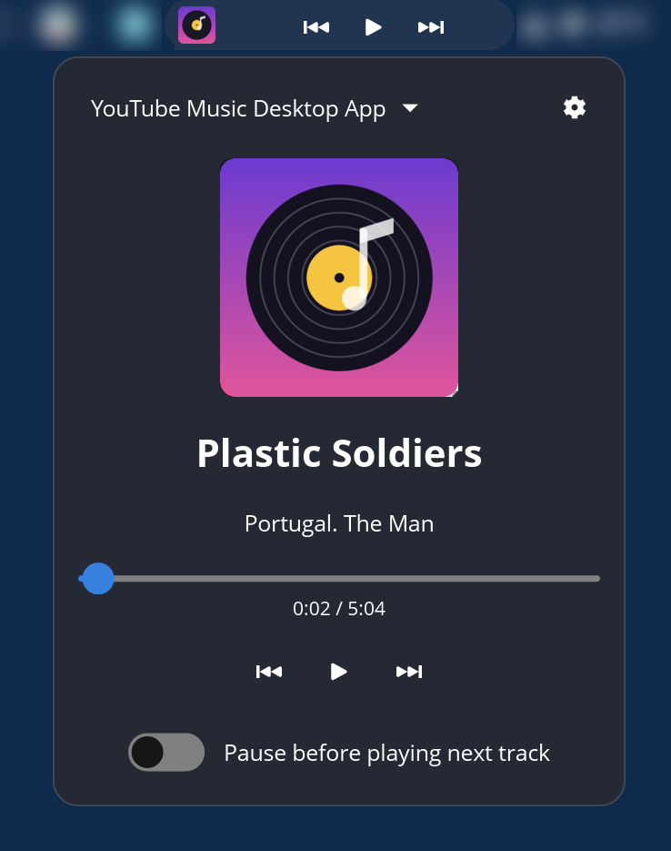
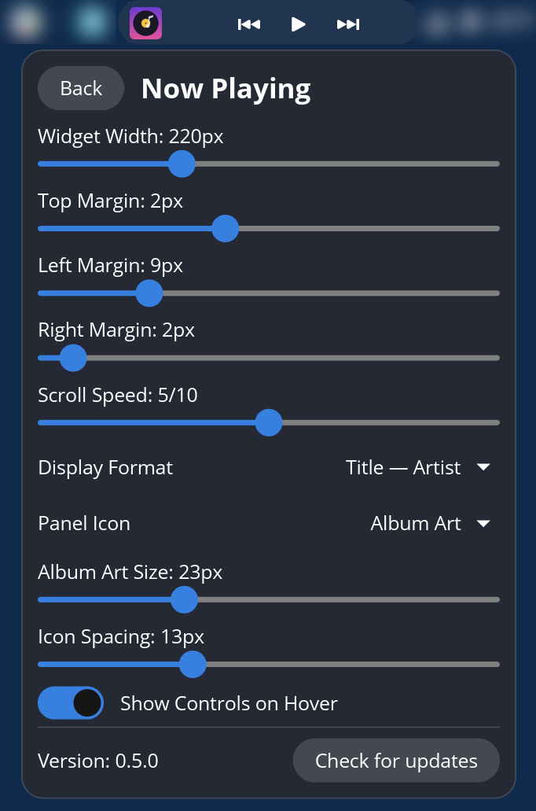

<p align="center">
  
</p>

<h1 align="center">COSMIC Media Now Playing Applet</h1>

<p align="center">
  <strong>A panel applet for the <a href="https://github.com/pop-os/cosmic-epoch">COSMIC™ Desktop Environment</a> that displays the currently playing media track.</strong>
</p>

<p align="center">
  
</p>

---

## Table of Contents

- [Overview](#overview)
- [Screenshots](#screenshots)
- [Features](#features)
  - [Supported Media Players](#supported-media-players)
  - [Album Art Sources](#album-art-sources)
- [Installation](#installation)
  - [Prerequisites](#prerequisites)
  - [Build & Install](#build--install)
  - [Install Script Commands](#install-script-commands)
- [Usage](#usage)
- [Configuration](#configuration)
  - [Settings Reference](#settings-reference)
  - [Config File Location](#config-file-location)
- [Architecture](#architecture)
  - [Technology Stack](#technology-stack)
  - [Source Structure](#source-structure)
  - [Key Design Decisions](#key-design-decisions)
- [Troubleshooting](#troubleshooting)
- [Contributing](#contributing)
- [License](#license)
- [Legal](#legal)

---

## Overview

**cosmic-media-now-playing-applet** is a lightweight panel applet that integrates with any [MPRIS](https://specifications.freedesktop.org/mpris-spec/latest/)-compatible media player (Spotify, Firefox, Chromium, VLC, Rhythmbox, Amberol, …) and shows the currently playing track directly on your COSMIC panel bar.

On the panel it displays the album art (or a music-note icon) next to the track title, and reveals inline playback controls on hover. Clicking anywhere on the widget opens a popup with larger album art, a seekable progress bar, playback controls, a player selector, a one-shot "pause before playing next track" switch, and settings. Long titles scroll in a marquee (which you can slow, speed up, or turn off). When nothing is playing, the applet takes up **zero** panel space.

It's **pure Rust** — no C D-Bus bindings — and every setting persists across restarts via COSMIC's `cosmic-config`.

---

## Screenshots

> **Note:** the album art in these screenshots is a placeholder graphic, substituted for the real cover art to avoid redistributing copyrighted images. The applet displays whatever artwork your player provides. Surrounding panel applets are blurred for privacy.

On the panel, the applet sits inline with your other applets — album art thumbnail plus the track title, which **scrolls as a marquee** when it's too long to fit:

<p align="center">
  
</p>

The hero image above shows the same widget with its **inline hover controls** (previous / play-pause / next) alongside the **media popup** — album art, title and artist, the seekable progress bar with elapsed and total time, playback controls, and the *pause before playing next track* switch.

The **settings view**, reached via the gear icon, keeps every option on one compact screen:

<p align="center">
  
</p>

---

## Features

| Feature | Description |
|---------|-------------|
| 🎵 **Inline panel display** | Album art (or music-note icon) plus the track name, right on the panel bar |
| 🖼️ **Panel album art** | The panel icon can be the live album-art thumbnail, a music note, or nothing |
| 🎚️ **Hover controls** | Hover the panel for inline previous / play-pause / next; the icon/art still opens the popup |
| 🧭 **Capability-aware buttons** | Previous/next are hidden automatically when the player doesn't support them (MPRIS `CanGoNext`/`CanGoPrevious`) |
| ⏩ **Seekable progress bar** | Scrub the track with a draggable slider and elapsed / total time — updated smoothly, not once a second |
| ⏸️ **Pause before next track** | Arm a one-shot stop: the current track finishes, then playback halts before the next one starts. Ideal for ending a session on the track you're on |
| ⏭️ **Next-track preview** | Shows the upcoming queued track for players that expose the MPRIS `TrackList` interface |
| 🔗 **Click art to open source** | Clicking the popup album art opens the track's URL (e.g. the YouTube tab) in your browser |
| 🎛️ **Player selector** | Choose which player to control when several are active |
| 🔄 **Auto-switching** | Automatically follows whichever player starts playing |
| 📜 **Marquee scrolling** | Long titles scroll with adjustable speed — or set it to **Off** for a static title |
| 📏 **Width, margins & spacing** | Widget width (100–500 px), top/left/right margins, and the icon-to-title gap |
| 🎨 **Display formats** | Title Only, Artist — Title, or Title — Artist |
| 🖱️ **Click anywhere** | The whole widget is clickable (with a pointer cursor) to open the popup |
| 👻 **Invisible when idle** | Takes up zero panel space when nothing is playing |
| 📦 **Sandbox-aware art** | Works across Flatpak, Snap, and native packages |
| 🦀 **Pure Rust + i18n** | `zbus` for native D-Bus; Fluent-based localization |

### Supported Media Players

Anything implementing the [MPRIS D-Bus interface](https://specifications.freedesktop.org/mpris-spec/latest/) works — Spotify, Firefox/Chromium/Chrome/Epiphany (web media), VLC, Amberol, Rhythmbox, Lollypop, GNOME Music, Celluloid (MPV), Audacious, Clementine/Strawberry, Elisa, and more.

### Album Art Sources

The applet loads art from whatever the player exposes:

- **`file://` URLs** — read directly, or via `/proc/<pid>/root` to reach files inside Flatpak/Snap sandboxes
- **`data:` URIs** — base64-encoded inline images (used by Firefox)
- **`https://` URLs** — fetched over HTTP (Spotify, etc.)
- **YouTube thumbnails** — derived from the track URL when a browser plays a YouTube video and the art file is otherwise inaccessible

---

## Installation

### Prerequisites

A working Rust toolchain (via [rustup](https://rustup.rs)) plus a few system development libraries.

> **Note:** Prefer rustup over the distro Rust package — rust-analyzer and other tooling work far better with the rustup-managed toolchain.

```bash
curl --proto '=https' --tlsv1.2 -sSf https://sh.rustup.rs | sh
```

<details>
<summary><strong>Ubuntu / Pop!_OS / Debian</strong></summary>

```bash
sudo apt install -y \
    cmake pkg-config libexpat1-dev libfontconfig-dev libfreetype-dev \
    libxkbcommon-dev libinput-dev libgbm-dev libseat-dev libudev-dev
```
</details>

<details>
<summary><strong>Fedora</strong></summary>

```bash
sudo dnf install -y \
    cmake pkg-config expat-devel fontconfig-devel freetype-devel \
    libxkbcommon-devel libinput-devel mesa-libgbm-devel libseat-devel systemd-devel
```
</details>

<details>
<summary><strong>Arch Linux</strong></summary>

```bash
sudo pacman -S --needed \
    cmake pkg-config expat fontconfig freetype2 libxkbcommon libinput seatd
```
</details>

### Build & Install

**Using the install script (recommended)** — builds, installs, and reloads the COSMIC panel so changes take effect immediately:

```bash
git clone https://github.com/stldave314/cosmic-media-now-playing-applet.git
cd cosmic-media-now-playing-applet
./install.sh build-install
```

<details>
<summary><strong>Using cargo directly</strong></summary>

```bash
cargo build --release

sudo install -Dm0755 target/release/cosmic-media-now-playing-applet /usr/bin/cosmic-media-now-playing-applet
sudo install -Dm0644 resources/app.desktop /usr/share/applications/com.github.cosmic_media_now_playing_applet.desktop
sudo install -Dm0644 resources/app.metainfo.xml /usr/share/appdata/com.github.cosmic_media_now_playing_applet.metainfo.xml
sudo install -Dm0644 resources/icon.svg /usr/share/icons/hicolor/scalable/apps/com.github.cosmic_media_now_playing_applet.svg
```
</details>

A custom prefix is supported: `PREFIX=/usr/local ./install.sh build-install`.

### Install Script Commands

| Command | Description |
|---------|-------------|
| `./install.sh build` | Build in release mode |
| `./install.sh install` | Install to system (sudo) and reload the panel |
| `./install.sh build-install` | Build and install in one step |
| `./install.sh uninstall` | Remove from system (with optional config cleanup) |
| `./install.sh reinstall` | Full uninstall → rebuild → reinstall |
| `./install.sh status` | Show what's currently installed |
| `./install.sh clean` | Remove build artifacts |
| `./install.sh help` | List all commands |

### Building Release Packages

Native packages are the right format for a COSMIC applet — they install the binary **and** the `.desktop` entry the panel needs to discover it (AppImage and Flatpak don't fit the applet model). Build them into `dist/`:

| Command | Output |
|---------|--------|
| `./install.sh package` | All available formats (skips `.deb`/`.rpm` if their tooling isn't installed) |
| `./install.sh package-tar` | Portable binary tarball (binary + resources + `install.sh`) |
| `./install.sh package-deb` | Debian/Ubuntu/Pop!_OS `.deb` — needs `cargo install cargo-deb` |
| `./install.sh package-rpm` | Fedora/RHEL `.rpm` — needs `cargo install cargo-generate-rpm` |

From a tarball, install without rebuilding: `BIN_SRC=./cosmic-media-now-playing-applet ./install.sh install`.

**Cutting a GitHub release:** push a version tag and the [`release`](.github/workflows/release.yml) workflow builds all three formats and attaches them to the release:

```bash
git tag v0.5.0 && git push origin v0.5.0
```

---

## Usage

**Add it to the panel:** COSMIC Settings → **Desktop** → **Panel** → **Add Applet** → **"Now Playing"**, then place it where you like.

**Try it without installing:** `cargo run --release`. (It's designed for the COSMIC panel; standalone it opens a test window, and popup positioning/panel sizing behave differently than in production.)

When media is playing you'll see the album art/icon and the (scrolling) title on the panel. **Hover** for inline controls; **click anywhere** to open the popup. When nothing is playing, the applet is invisible.

---

## Configuration

Click the applet to open the **media popup** (player selector, album art, title/artist, seek bar, and playback controls), then click the gear icon (⚙) for **settings**. All settings apply immediately and save automatically.

### Pause Before Playing Next Track

Below the playback controls is a switch that arms a **one-shot stop**: the current track plays to the end, then playback halts before the next one starts, and stays paused until you press play. It's for stepping away without cutting off what's playing.

- While armed, the control is **outlined in your accent colour** so the pending stop is obvious. Clicking anywhere on it — switch, label, or padding — toggles it.
- It **disarms itself** after firing, and pressing play/pause manually also cancels it.
- It's **disabled when there is no next track** (MPRIS `CanGoNext`).
- It stops shortly *before* the current track ends, so the player never advances into the next one.

### Settings Reference

| Setting | Range / Options | Default | Notes |
|---------|-----------------|---------|-------|
| **Widget Width** | 100 – 500 px | 200 px | Debounced — the panel resizes cleanly after you stop dragging |
| **Top Margin** | -10 – 20 px | 0 px | Shifts content vertically |
| **Left Margin** | 0 – 40 px | 0 px | Padding before the icon/content |
| **Right Margin** | 0 – 40 px | 0 px | Padding after the content |
| **Scroll Speed** | Off, 1 – 10 | 5 | 1 ≈ 300 ms/step, 10 ≈ 30 ms/step. **Off** keeps the visible portion static until the track changes |
| **Display Format** | Title Only · Artist — Title · Title — Artist | Artist — Title | Falls back to title alone when the player reports no artist |
| **Panel Icon** | Album Art · Music Note · No Icon | Album Art | Album Art falls back to a music note when no art is available |
| **Album Art Size** | 12 – 48 px | 16 px | Size of the panel thumbnail (and music-note fallback) |
| **Icon Spacing** | 0 – 40 px | 6 px | Gap between icon/art and title; hidden when Panel Icon is "No Icon" |
| **Show Controls on Hover** | On / Off | On | Requires a Panel Icon other than "No Icon"; prev/next appear only when supported and there's room |

### Config File Location

Stored via `cosmic-config` at:

```
~/.config/cosmic/com.github.cosmic_media_now_playing_applet/v1/
```

---

## Architecture

### Technology Stack

| Component | Technology |
|-----------|-----------|
| GUI framework | [libcosmic](https://github.com/pop-os/libcosmic) (iced-based) |
| D-Bus | [zbus](https://crates.io/crates/zbus) v5 (pure Rust, async) |
| Async runtime | [Tokio](https://tokio.rs/) |
| Config persistence | [cosmic-config](https://github.com/pop-os/libcosmic) |
| Localization | [i18n-embed](https://crates.io/crates/i18n-embed) + [Fluent](https://projectfluent.org/) |
| HTTP (album art) | [reqwest](https://crates.io/crates/reqwest) |

```
┌─────────────────────────────────────────────────────┐
│                    COSMIC Panel                      │
│   ┌──────────────────────────────────────────────┐  │
│   │  🖼  Artist — Track Title  ←←← scrolling     │  │  ← hover: [⏮][⏯][⏭]
│   └──────────────┬───────────────────────────────┘  │
│                  │ click anywhere                    │
│   ┌──────────────▼───────────────────────────────┐  │
│   │  [Player Dropdown ▾]                    [⚙]  │  │
│   │  ┌──────────────────────────────────────┐    │  │
│   │  │   🖼 Album Art (click → open URL)     │    │  │
│   │  └──────────────────────────────────────┘    │  │
│   │           Track Title / Artist Name           │  │
│   │  ──────●─────────────────  1:23 / 3:45        │  │
│   │        [⏮]  [⏯]  [⏭]                        │  │
│   │        Next: Artist — Title  (TrackList only) │  │
│   │        (•—) Pause before playing next track   │  │
│   └──────────────────────────────────────────────┘  │
└─────────────────────────────────────────────────────┘

  Background subscriptions:
    MPRIS Poller (1s) ─→ D-Bus session bus
    Scroll Timer      ─→ marquee animation (skipped when Off / text fits)
    Config Watcher    ─→ cosmic-config
    Pointer Events    ─→ panel hover detection
    Progress Ticker   ─→ smooth seek bar (only while popup open + playing)
    Armed Watcher     ─→ pause before next track (only while armed)
```

### Source Structure

```
├── Cargo.toml       # Dependencies & project metadata
├── install.sh       # Build/install/uninstall script
├── i18n.toml        # Localization configuration
├── i18n/en/…ftl     # English (fallback) strings
├── resources/       # icon.svg, desktop entry, AppStream metadata, screenshots
└── src/
    ├── main.rs      # Entry point — i18n init + applet launch
    ├── app.rs       # Application model, view, update, subscriptions
    ├── config.rs    # Persistent user settings (cosmic-config)
    ├── constants.rs # Centralized compile-time tuning values
    ├── debug.rs     # Build-time diagnostic logging (off by default)
    ├── mpris.rs     # Pure-Rust MPRIS D-Bus client (zbus)
    └── i18n.rs      # Localization boilerplate
```

### Key Design Decisions

- **Pure-Rust D-Bus** — [zbus](https://crates.io/crates/zbus) (async, pure Rust) instead of wrapping C libraries, eliminating all C D-Bus dependencies.
- **Sandbox-aware art loading** — MPRIS `file://` art paths often point inside a sandboxed process's private filesystem. The applet resolves the player's PID over D-Bus and reads through `/proc/<pid>/root/<path>`, which works uniformly for Flatpak, Snap, and other sandboxes. YouTube thumbnails serve as a fallback for browsers when the file is unreachable.
- **Capability-aware controls** — previous/next follow the player's MPRIS `CanGoNext` / `CanGoPrevious`, so they disappear for sources that can't skip (single streams, the last item in a queue, …).
- **Seeking** — the progress bar reads `Position` / `mpris:length` and commits scrubs via MPRIS `SetPosition`, shown only when the player reports a duration. Between the 1 s polls the position is interpolated from elapsed wall-clock time and redrawn at ~10 fps, so the bar glides instead of stepping once a second; each poll re-syncs it, so drift can't accumulate.
- **Pausing before the next track** — MPRIS has no "stop after current track", so this is built on top of it. Reacting to the track *change* is a race that can't be won: by the time any client observes the new track, the player is already producing audio. So the watcher is **predictive** — it tracks position against duration and pauses 300 ms before the end, meaning the player never advances at all. It sleeps exactly as long as it needs to reach that point (capped at 500 ms), costing only a handful of D-Bus calls per track. Detecting the track change remains a fallback for cases prediction can't cover — unknown duration (live streams), gapless/crossfaded transitions, or a manual skip — where it pauses and rewinds the new track to 0:00.
- **Track identity** — "has the track changed?" is keyed on a composite of `mpris:trackid` + `xesam:url` + title + artist, because some players (notably browsers) reuse a single track id for a whole session. MPRIS delivers Metadata as one dict, so these fields change together and can't disagree mid-update.
- **Constants vs. settings** — values a user should control live in `config.rs` (persisted via `cosmic-config`, with UI and validation); internal tuning values live in `constants.rs` as compile-time constants. Package metadata such as the update URL and user agent is derived from `Cargo.toml` via `env!("CARGO_PKG_*")` so it has a single source of truth.
- **Diagnostic logging** — `debug.rs` writes categorised diagnostics to a file rather than stderr, since an applet's stderr is piped to `cosmic-panel` and ends up on the session TTY. It's gated on a compile-time constant, so when disabled the `debug_log!` macro's body is dead code and the optimiser removes it entirely — no formatting, no I/O, and the log path doesn't even appear in the binary. Set `DEVELOPER_LOGGING` in `debug.rs` to enable it while debugging; the packaging targets build with the `release-build` feature, which forces it off so a release can never ship with logging on.
- **Hover detection** — because the applet surface is autosized to exactly the widget, the pointer leaves the *surface* rather than crossing widget bounds, which a `mouse_area`'s hover state doesn't track reliably. Hover is instead detected via a raw `CursorMoved` / `CursorLeft` subscription filtered to the applet's own surface. The whole widget is one button (so any click opens the popup) while nested control buttons capture their own clicks.
- **Auto-switching** — detects a player transitioning from paused to playing and switches focus to it.
- **Debounced panel resizing** — width changes commit only after 1.5 s of inactivity, sending a single clean resize request instead of many rapid ones that could overlap applets.
- **Marquee scrolling** — character-offset windowing over a looping buffer; the scroll subscription is disabled entirely when the text fits or scrolling is Off.

---

## Troubleshooting

**Applet not visible even though music is playing.** It hides itself until a track title is available, and some players take a moment to populate MPRIS metadata. Verify MPRIS support with `busctl --user list | grep MediaPlayer2` (you should see entries like `org.mpris.MediaPlayer2.spotify`). For browsers, make sure the tab with media is active.

**Album art not showing.** Local players usually embed art (works automatically); browsers on YouTube use the thumbnail; Spotify fetches over HTTPS. If art still doesn't appear, confirm network access and that the player exposes `mpris:artUrl`.

**Hover controls don't appear.** They require **Show Controls on Hover** enabled (default) **and** a **Panel Icon** other than "No Icon" (the icon/art anchors the popup click). Previous/next also need player support and enough widget width; otherwise you'll see just play/pause.

**"Pause before playing next track" is greyed out.** The player is reporting no next track (`CanGoNext = false`) — common for a single stream or the last item in a queue.

**It still plays a moment of the next track.** The pre-emptive stop relies on the player reporting a usable `Position` and `mpris:length`. When either is missing or stale — live streams, and some browser-hosted players — prediction isn't possible, and the applet falls back to reacting to the track change, which inherently lands slightly late. It then rewinds the new track to 0:00 so play resumes from its start.

**"Next: …" never appears.** It needs the optional MPRIS `TrackList` interface, which most players — including browsers and Spotify — don't implement. VLC is one that does. Check with `busctl --user introspect <player-bus> /org/mpris/MediaPlayer2 | grep TrackList`.

**Applet missing from the COSMIC applet list.** Run `./install.sh status`; if anything is missing, `./install.sh reinstall`.

**Applet overlaps other panel items after resizing.** Wait ~2 s after releasing the width slider — the panel redraws once the resize settles.

**Build errors about missing system libraries.** Install the [Prerequisites](#prerequisites) for your distro.

---

## Contributing

Contributions are welcome — report bugs, suggest features, or open PRs (fork, branch, code, PR).

**Add a translation:** copy `i18n/en/cosmic_media_now_playing_applet.ftl` to `i18n/<lang_code>/`, translate the values (leave the keys alone), and submit a PR. Every user-facing string goes through Fluent, so that one file covers the whole UI. Keys taking arguments — `version-label`, `update-uptodate`, `update-available` — must keep their `{ $placeholders }`.

Example (`i18n/es/…ftl`):

```ftl
no-media = Sin reproducción
pause-next-track = Pausar antes de la siguiente pista
next-label = Siguiente
widget-width = Ancho del widget
scroll-speed = Velocidad de desplazamiento
scroll-off = Desactivado
display-format = Formato de visualización
format-title-only = Solo título
format-artist-title = Artista — Título
format-title-artist = Título — Artista
app-title = Reproduciendo ahora
top-margin = Margen superior
left-margin = Margen izquierdo
right-margin = Margen derecho
panel-icon = Icono del panel
panel-icon-album-art = Carátula
panel-icon-music-note = Icono de nota musical
panel-icon-none = Sin icono
art-size = Tamaño de la carátula
icon-spacing = Espaciado del icono
hover-controls = Mostrar controles al pasar el cursor
back = Atrás
check-updates = Buscar actualizaciones
version-label = Versión: { $version }
update-checking = Comprobando…
update-uptodate = Actualizado (v{ $version })
update-available = Actualización disponible: v{ $remote } (actual: v{ $local })
update-error-client = No se pudo crear el cliente HTTP.
update-error-connect = No se pudo conectar con GitHub.
update-error-read = No se pudo leer la respuesta.
update-error-parse = No se pudo interpretar la versión.
```

---

## License

Licensed under the **GNU General Public License v3.0** — see [LICENSE](LICENSE).

## Legal

**No affiliation.** This is an independent, community-built applet. It is not affiliated with, endorsed by, sponsored by, or otherwise associated with System76, Inc., nor with any media player or streaming service it interoperates with.

**Trademarks.** COSMIC™ and System76® are trademarks or registered trademarks of System76, Inc. Other product, service, and company names referenced here — including Spotify, YouTube Music, Firefox, Chromium, VLC, and others — are trademarks or registered trademarks of their respective owners. All such marks are used descriptively, to identify the software this applet works with, and their use implies no affiliation with or endorsement by their owners.

**No warranty — use at your own risk.** This software is provided "as is", without warranty of any kind, express or implied, including but not limited to the implied warranties of merchantability, fitness for a particular purpose, and non-infringement. The authors and copyright holders accept no liability for any claim, damages, or other loss arising from its use. Sections 15 and 16 of the [GNU GPL v3](LICENSE) contain the governing disclaimer of warranty and limitation of liability; nothing here modifies or supersedes them.

**Media and content.** The applet only reads metadata that media players publish over the standard [MPRIS D-Bus interface](https://specifications.freedesktop.org/mpris-spec/latest/) and displays artwork those players make available locally or by public URL. It does not download, cache for redistribution, decrypt, or circumvent access controls on any media, and it provides no playback capability of its own. You remain responsible for complying with the terms of the media services, players, and content you use it with.

**Screenshots.** Album art shown in this README is a placeholder graphic rather than real cover art; see [Screenshots](#screenshots).

## Acknowledgments

- [COSMIC Desktop Environment](https://github.com/pop-os/cosmic-epoch) by System76
- [libcosmic](https://github.com/pop-os/libcosmic) — the COSMIC application framework
- [zbus](https://crates.io/crates/zbus) — pure-Rust D-Bus implementation
- [MPRIS Specification](https://specifications.freedesktop.org/mpris-spec/latest/) — the media player interface standard

---

<p align="center">
  Made with 🦀 for the COSMIC Desktop
</p>
